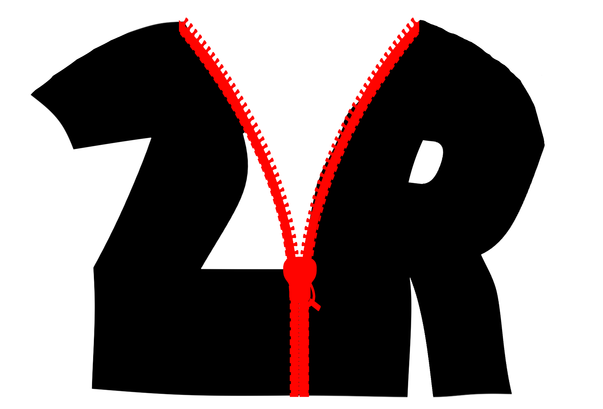

# <p align="center">ZipRunner</p>

<p align="center">Research Project by Ojas Talgaonkar</p>

<div align="center">
  
</div>

## Overview

**ZipRunner** is an innovative research project aimed at exploring methods to execute programs directly from `.zip` archives without the need for prior extraction. This approach seeks to enhance efficiency and streamline workflows by reducing the steps required to run compressed applications.

## Motivation

As someone whose laptop only has 450 GB of storage, I wanted to try making it so that I can still play my favorite games without having them constantly take up a sizable chunk of my storage. An already existing tool like 7zip, unzips folders before execution and then zips them back up at termination, but my goal is to run the compressed files themselves.

## Features

- **Direct Execution**: Run applications straight from `.zip` files without manual extraction.
- **Cross-Platform Support**: Compatible with multiple operating systems, ensuring broad usability.
- **Resource Optimization**: Saves disk space and reduces clutter by eliminating the need for extracted files.

## Current Progress

The "prep" folder contains all my practice programs for features that will be essential in building ZipRunner. These include:

- **Binary File reconstruction**
- **Zipping Algorithms**
- **Runtime Emulation**

### Clone the Repository

```bash
git clone https://github.com/OjasTalgaonkar/ZipRunner.git
```
